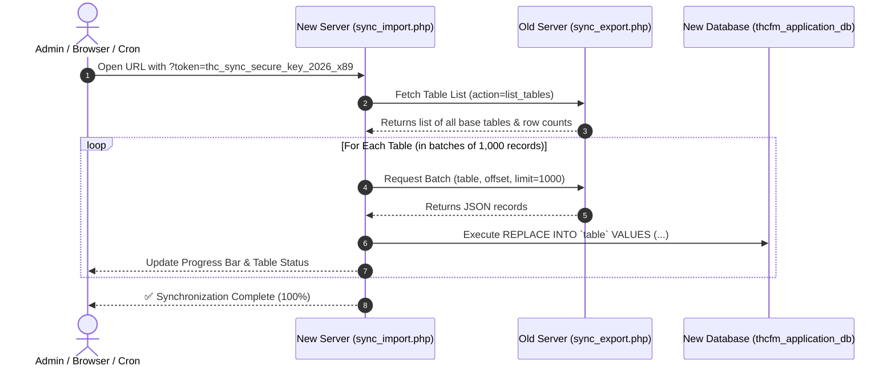

# THC Portal - Database Synchronization Process Documentation

## 1. Overview & Purpose

This document outlines the real-time database synchronization architecture between the **Old Production Server** (`sianlab.com`) and the **New Server** (`portal.thcfm.com`).

Because the new server is in the testing and staging stage, this synchronization mechanism allows administrators to pull live production data on-demand from the old server into the new server's database (`thcfm_application_db`) without disrupting live operations.

---

## 2. Server Endpoints & Configuration

| Property | Details |
| :--- | :--- |
| **New Server (Importer & UI)** | `https://portal.thcfm.com/api/sync_import.php` |
| **Old Server (Exporter API)** | `https://sianlab.com/thc/api/sync_export.php` |
| **Cron Runner Script** | `api/cron_sync.php` |
| **Security Token** | `thc_sync_secure_key_2026_x89` |
| **Target Database** | `thcfm_application_db` on `portal.thcfm.com` |
| **Source Database** | `sianlab_db_thc` on `sianlab.com` |

---

## 3. Synchronization Workflow



---

## 4. Step-by-Step Technical Breakdown

### Step 1: Security Handshake & Access Control
- Access to `sync_import.php` and `sync_export.php` requires either:
  1. A valid security token passed via query parameter: `?token=thc_sync_secure_key_2026_x89`
  2. Or an active logged-in administrator session (`$_SESSION['loggedin']`).
- Requests with invalid or missing credentials receive an `HTTP 403 Forbidden` response.

### Step 2: Table Discovery
- The new server calls `sync_export.php?action=list_tables`.
- The export script queries:
  ```sql
  SHOW FULL TABLES WHERE Table_type = 'BASE TABLE'
  ```
- It counts the rows in each table and returns the full table catalog with row counts in JSON format.

### Step 3: Batched Pagination (1,000 Records / Request)
- To prevent PHP execution timeouts and memory exhaustion on large datasets:
  - Tables are fetched in chunks of **1,000 rows** (`offset=0`, `offset=1000`, `offset=2000`, etc.).
  - The process continues until all records for the table are retrieved.

### Step 4: Database Injection & Replacement (`REPLACE INTO`)
- Before inserting table rows, foreign key constraints are temporarily relaxed:
  ```sql
  SET FOREIGN_KEY_CHECKS = 0;
  SET SQL_MODE = 'NO_AUTO_VALUE_ON_ZERO';
  ```
- Records are inserted using MySQL's `REPLACE INTO`:
  ```sql
  REPLACE INTO `table_name` (`col1`, `col2`, ...) VALUES (...), (...);
  ```
- Foreign key checks are restored once the table completes (`SET FOREIGN_KEY_CHECKS = 1`).

---

## 5. Data Matching & Overwrite Logic

| Scenario | Behavior |
| :--- | :--- |
| **Record exists on both Old and New Server (Matching ID)** | The version from the **Old Server** overwrites/updates the record on the New Server. |
| **Record exists ONLY on Old Server (New ID)** | The record is newly inserted into the New Server. |
| **Record exists ONLY on New Server (Unique ID)** | The record remains untouched on the New Server. |
| **Old Production Server State** | **100% Safe (Read-Only).** The sync only reads data from the old server; no write or delete operations occur on the old server. |

---

## 6. How to Run Synchronization

### Option A: Interactive Web UI (Recommended)
1. Open the following link in your browser:
   ```
   https://portal.thcfm.com/api/sync_import.php?token=thc_sync_secure_key_2026_x89
   ```
2. Click the **▶ Start Live Sync** button.
3. Monitor the live progress bar, processed tables counter, and table status badges.

### Option B: Automatic Sync Trigger
Add `&auto=1` to the URL to start synchronization immediately upon page load:
```
https://portal.thcfm.com/api/sync_import.php?token=thc_sync_secure_key_2026_x89&auto=1
```

### Option C: cPanel Scheduled Cron Job (Background Sync)
To run automated sync in the background on the new server via cPanel Cron:
```bash
php /home/thcfm/public_html/portal.thcfm.com/api/cron_sync.php
```

---

## 7. Important Notes & Best Practices

1. **Database vs Files**:
   - The sync handles all MySQL **database tables** and records.
   - User-uploaded physical files (such as images, PDF documents in `view/uploads/` and `httpdocs/images/`) reside on the filesystem and are not part of the MySQL data stream. Copy files via cPanel File Manager or FTP when needed.
2. **Browser Cache**:
   - After running a sync, perform a hard refresh (`Ctrl + F5`) on the portal to view the latest cached assets and tables.
3. **Execution Limits**:
   - `sync_import.php` sets `memory_limit = 1024M` and `set_time_limit(600)` to ensure smooth processing of large databases.
